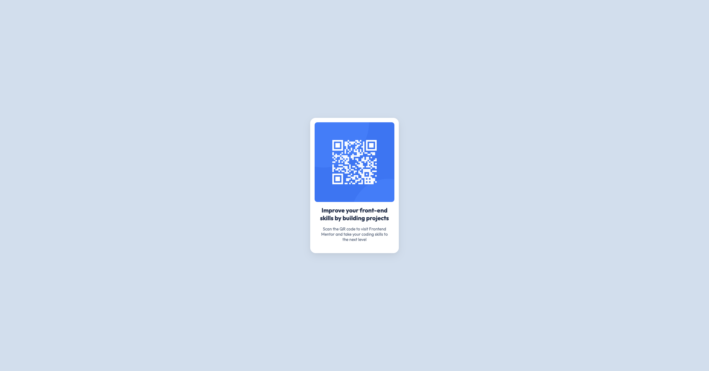

# Frontend Mentor - QR code component solution

This is a solution to the [QR code component challenge on Frontend Mentor](https://www.frontendmentor.io/challenges/qr-code-component-iux_sIO_H). Frontend Mentor challenges help you improve your coding skills by building realistic projects. 

## Table of contents

- [Overview](#overview)
  - [Screenshot](#screenshot)
  - [Links](#links)
- [My process](#my-process)
  - [Built with](#built-with)
  - [What I learned](#what-i-learned)
  - [Continued development](#continued-development)
  - [Useful resources](#useful-resources)
- [Author](#author)

## Overview

### Screenshot

### Links

- Solution URL: [https://github.com/KaiWenzel/qr-code-component](https://github.com/KaiWenzel/qr-code-component)
- Live Site URL: [https://kaiwenzel.github.io/qr-code-component/](https://kaiwenzel.github.io/qr-code-component/)

## My process

### Built with

- Semantic HTML5 markup
- CSS
- Flexbox
- Mobile-first workflow

### What I learned

Using flexbox, it's really easy to create cards that are centered responsively. Also, you'll need to include relative paths instead of absolute paths for GitHub to find a linked file. 

It's also sometimes hard to judge how close you came to the original design. Especially for the shadow of the card you'll need to judge by eye if it fits or not. 

Overall, it got me used to working with git, pushing it to GitHub and setting up Pages, so everyone can see my work. 

### Continued development

In future projects I would like to focus on responsives designs as I don't have much experience with flexbox and grid yet. 

Furthermore, I would like to learn more about how to make my work more accessible to different kind of users who may have disabilities. 

### Useful resources

- [w3schools](https://www.w3schools.com/css/default.asp) - This really helped me looking up some CSS details and see how it's being applied
- [Gemini](https://gemini.google.com/) - When I needed some clearance on how to apply new concepts

## Author

- Website - No official website yet
- Frontend Mentor - [@KaiWenzel](https://www.frontendmentor.io/profile/KaiWenzel)